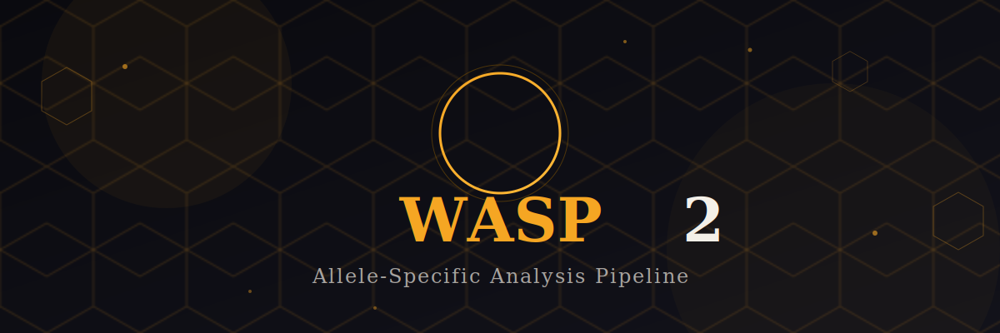

<p align="center">
  
</p>

<p align="center">
  <a href="https://github.com/Jaureguy760/WASP2-final/actions/workflows/ci.yml">
    
  </a>
  <a href="https://jaureguy760.github.io/WASP2-final/">
    
  </a>
  <a href="https://github.com/Jaureguy760/WASP2-final/blob/main/LICENSE">
    
  </a>
</p>

<p align="center">
  <a href="https://jaureguy760.github.io/WASP2-final/">Documentation</a> •
  <a href="https://jaureguy760.github.io/WASP2-final/_static/podcast/">Podcast</a> •
  <a href="https://mcvicker.salk.edu/">McVicker Lab</a> •
  <a href="https://github.com/bmvdgeijn/WASP">Original WASP</a>
</p>

---

## Quick Start

```bash
pip install wasp2

wasp2-count count-variants reads.bam variants.vcf.gz -s sample1
```

## Authors

- **Aaron Ho** — Creator of WASP2
- **Jeff Jaureguy** — Developer and maintainer
- **[McVicker Lab](https://mcvicker.salk.edu/)**, Salk Institute

## Citation

If you use WASP2 in your research, please cite our paper (coming soon).
