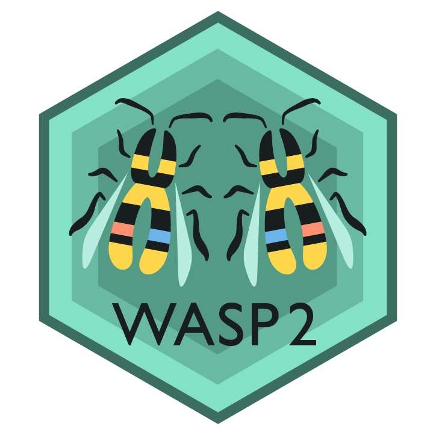

<h1 align="center">

</h1>

<p align="center">
  <a href="https://github.com/Jaureguy760/WASP2-exp/actions/workflows/docs.yml">
    
  </a>
  <a href="https://jaureguy760.github.io/WASP2-exp/">
    
  </a>
  <a href="https://test.pypi.org/project/wasp2-rust/">
    
  </a>
  <a href="https://github.com/Jaureguy760/WASP2-exp/blob/master/LICENSE">
    
  </a>
  
  
</p>

# WASP2: Allele-specific pipeline for unbiased read mapping and allelic-imbalance analysis

## Requirements
- Python >= 3.7
- numpy
- pandas
- polars
- scipy
- pysam
- pybedtools
- typer
- anndata
- Rust extension (PyO3) built locally; the Python CLI now routes counting, mapping, and analysis through Rust. Build it after creating the conda env:
  ```bash
  conda activate WASP2
  export LIBCLANG_PATH=$CONDA_PREFIX/lib
  export LD_LIBRARY_PATH=$CONDA_PREFIX/lib:$LD_LIBRARY_PATH
  export BINDGEN_EXTRA_CLANG_ARGS="-I/usr/include"
  (cd rust && maturin develop --release)
  ```


## Installation

### Quick Start: GitHub Codespaces ☁️
Get started in seconds with a fully configured cloud development environment:
1. Click **"Code"** → **"Codespaces"** → **"Create codespace"**
2. Wait 2-3 minutes for setup
3. Start using WASP2 - all dependencies pre-installed!

See [`.devcontainer/README.md`](.devcontainer/README.md) for details.

### Local Installation
Recommended installation through conda, and given environment
```shell script
conda env create -f environment.yml
```

## Build the Rust extension (required)
```bash
conda activate WASP2
export LIBCLANG_PATH=$CONDA_PREFIX/lib
export LD_LIBRARY_PATH=$CONDA_PREFIX/lib:$LD_LIBRARY_PATH
export BINDGEN_EXTRA_CLANG_ARGS="-I/usr/include"
maturin develop --release -m rust/Cargo.toml
```

## Quick CLI usage
- Count: `python -m src.counting count-variants BAM VCF --regions BED --out_file counts.tsv`
- Map filter: `python -m src.mapping filter-remapped ORIGINAL.bam REMAPPED.bam OUT.bam`
- Analyze: `python -m src.analysis analyze --count_file counts.tsv --out_file ai_results.tsv`

## Minimal API (Rust-backed)
```python
from counting.run_counting import run_count_variants
from mapping.filter_remap_reads import filt_remapped_reads
from analysis.run_analysis import run_ai_analysis

run_count_variants(bam_file="sample.bam", vcf_file="variants.vcf", region_file="regions.bed")
filt_remapped_reads("orig.bam", "remap.bam", "keep.bam", threads=4)
run_ai_analysis("counts.tsv", out_file="ai_results.tsv")
```

## Validation
Baselines are generated on-demand. With the extension built:
```bash
export PYTHONPATH=$PWD
python validation/generate_baselines.py
python validation/compare_to_baseline.py
```
This runs counting, mapping, and analysis on the small chr10 test bundle and checks parity.

## Publish to private index (example)
```bash
maturin build --release -m rust/Cargo.toml
pip install twine
twine upload --repository-url https://<private-index>/simple dist/*.whl
# Install:
pip install --index-url https://<private-index>/simple wasp2
```

## API Documentation
Build Sphinx docs locally:
```bash
pip install sphinx sphinx-rtd-theme sphinx-autodoc-typehints
cd docs && make html
# Open docs/build/html/index.html in a browser
```

&nbsp;
## Allelic Imbalance Analysis
Analysis pipeline currently consists of two tools (Count and Analysis)

&nbsp;
### Count Tool
Process allele specific read counts per SNP.\
Sample names can be provided in order to filter out non-heterozygous SNPs.
Genes and ATAC-seq peaks can also be provided to include SNPs that overlap regions of interest.\
Providing samples and regions is highly recommended for allelic-imbalance analysis

**Usage**
```shell script
python WASP2/src/counting count-variants [BAM] [VCF] {OPTIONS}
```

**Required Arguments**
- BAM file containing aligned reads.
- VCF file containing SNP info


**Optional Arguments**
- -s/--samples: Filter SNPs whose genotypes are heterozygous in one or more samples. Accepts comma delimited string, or file with one sample per line. 
- -r/--region: Filter SNPs that overlap peaks/regions of interest. Accepts files in narrowPeak, BED, gtf and gff3 format.
- -o/--out_file: Output file for counts. Defaults to counts.tsv
- -t/--temp_loc: Write intermediary files to a directory instead of deleting. Useful for debugging issues.
- --use_region_names: If regions are provided use region names as identifiers instead of coordinates. Names are denoted in fourth column of BED. Ignored if no name column in BED file.


**RNA-Seq Specific Arguments**
- --gene_feature: Feature type in gtf/gff3 for counting intersecting SNPs. Defaults to 'exon' for snp counting.
- --gene_attribute: Attribute name from gtf/gff3 attribute column to use as ID. Defaults to '<feature>_id' in gtf and 'ID' in gff3.
- --gene_parent: Parent attribute in gtf/gff3 for feature used in counting. Defaults to 'transcript_id' in gtf and 'Parent' in gff3.


&nbsp;
### Analysis Tool
Analyzes Allelic Imbalance per ATAC peak given allelic count data

**Usage**
```shell script
python WASP2/src/analysis find-imbalance [COUNTS] {OPTIONS}
```
**Required Arguments**
- COUNTS: Output data from count tool

**Optional Arguments**
- -o/--out_file: Output file to write analysis results to. (Default. ai_results.tsv)
- --min: Minimum allele count needed for analysis. (Default. 10)
- -p/--pseudocount: Pseudocount added when measuring allelic imbalance. (Default. 1)
- --phased: Calculate allelic imbalance using phased haplotype model. By default, calculates AI assuming unphased/equal likelihood for each haplotype.
- --region_col: Name of region column for current data. Use 'region' for ATAC-seq. Plans for 'genes' for RNA-seq and 'SNP' for per SNP. Recommended to leave blank. (Default: Auto-parses if none provided)
- --groupby: Report allelic imbalance by parent group instead of feature level in RNA-seq counts.  Name of parent column. Not valid if no parent column or if using ATAC-seq peaks. (Default: Report by feature level instead of parent level)


&nbsp;
## Unbiased Allele-Specific Read Mapping
Mappability filtering pipeline for correcting allelic mapping biases.\
First, reads are mapped normally using a mapper chosen by the user (output as BAM). Then mapped reads that overlap single nucleotide polymorphisms (SNPs) are identified. For each read that overlaps a SNP, its genotype is swapped with that of the other allele and the read is re-mapped. Re-mapped reads that fail to map to exactly the same location in the genome are discarded.


### Step 1: Create Reads for Remapping
This step identifies reads that overlap snps and creates reads with swapped alleles.

**Usage**
```shell script

python WASP2/src/mapping make-reads [BAM] [VCF] {OPTIONS}
```


**Required Arguments**
- BAM file containing aligned reads.
- VCF file containing SNP info


**Optional Arguments**
- --threads: Threads to allocate.
- -s/--samples: Filter Polymorphic SNPs in one or more samples. Accepts comma delimited string, or file with one sample per line. 
- -o/--out_dir: Output directory for data to be remapped
- -t/--temp_loc: Write intermediary files to a directory instead of deleting. Useful for debugging issues.
- -j/--out_json: Output json containing wasp file info to this file instead of default. Defaults to [BAM_PREFIX]_wasp_data_files.json


### Step 2: Remap Reads
Remap fastq reads using mapping software of choice


**Example**
```shell script
bwa mem -M "BWAIndex/genome.fa" "${prefix}_swapped_alleles_r1.fq" "${prefix}_swapped_alleles_r2.fq" | samtools view -S -b -h -F 4 - > "${prefix}_remapped.bam"
samtools sort -o "${prefix}_remapped.bam" "${prefix}_remapped.bam"
samtools index "${prefix}_remapped.bam"
```


### Step 3: Filter Reads that Fail to Remap
Identify and remove reads that failed to remap to the same position. Creates allelic-unbiased bam file

**Usage**
```shell script
python WASP2/src/mapping filter-remapped "${prefix}_remapped.bam" --json "${prefix}_wasp_data_files.json"
```

OR

```shell script
python WASP2/src/mapping filter-remapped "${prefix}_remapped.bam" "${prefix}_to_remap.bam" "${prefix}_keep.bam"
```

**Required Arguments**
- Remapped BAM File
- Either: json or to_remap_bam + keep.bam
    - -j/--json: json containing wasp file info. Default output from make-reads: [BAM_PREFIX]_wasp_data_files.json
    - to_remap_bam: to_remap_bam used to generate swapped alleles. Default: [BAM_PREFIX]_to_remap.bam
    - keep_bam: BAM containing reads that were not remapped. Default: [BAM_PREFIX]_keep.bam

**Optional Arguments**
- --threads: Threads to allocate.
- -o/--out_bam: File to write filtered bam. Defaults to [BAM_PREFIX]_wasp_filt.bam.
-  --remap_keep_bam: Output bam file with kept reads to this file if provided.
-  --remap_keep_file: Output txt file with kept reads names to this file if provided.


&nbsp;
## Single-Cell Allelic Counts

Process allele specific read counts for single-cell datasets.\
Output counts as anndata containing cell x SNP count matrix.

**Usage**
```shell script
python WASP2/src/counting count-variants-sc [BAM] [VCF] [BARCODES] {OPTIONS}
```

**Required Arguments**
- BAM file containing aligned reads.
- VCF file containing SNP info
- BARCODE file used as index, contains one cell barcode per line

**Optional Arguments**
- -s/--samples: Filter SNPs whose genotypes are heterozygous in one or more samples. Accepts comma delimited string, or file with one sample per line. RECOMMENDED TO USE ONE SAMPLE AT A TIME.
- -f/--feature: Features used in single-cell experiment. Filter SNPs that overlap regions/features of interest. Accepts BED formatted files.
- -o/--out_file: Output file for counts. Defaults to allele_counts.h5ad
- -t/--temp_loc: Write intermediary files to a directory instead of deleting. Useful for debugging issues.


&nbsp;
## Single-Cell Allelic Imbalance

Estimate allele-specific chromatin acccessibility using single-cell allelic counts.\
Allelic-Imbalance is estimated on a per-celltype basis.

**Usage**
```shell script
python WASP2/src/counting find-imbalance-sc [COUNTS] [BARCODE_MAP] {OPTIONS}
```

**Required Arguments**
- COUNTS file (.h5ad) containing matrix of single-cell allelic counts.
- BARCODE MAP: Two column TSV file mapping specific cell barcodes to some group/celltype.\
Each line following format ... [BARCODE] \t [CELLTYPE]

**Optional Arguments**
- -o/--out_file: Output file to write analysis results to. (Default. ai_results_[GROUP].tsv)
- --min: Minimum allele count needed for analysis. (Default. 10)
- -p/--pseudocount: Pseudocount added when measuring allelic imbalance. (Default. 1)
- -s/--sample: Use het genotypes for this sample in count matrix. Automatically parse if data contains 0 or 1 sample. REQUIRED IF MULTIPLE SAMPLES IN DATA.
- --phased: Calculate allelic imbalance using phased haplotype model. By default, calculates AI assuming unphased/equal likelihood for each haplotype.
- --unphased: Explicitly use unphased model.
- -z/--z_cutoff: Remove SNPS and associated regions whose counts exceed Z-score cutoff. Extra layer of QC for single-cell allelic counts


&nbsp;
## Single-Cell Comparative Imbalance

Compare differential allelic-imbalance between celltypes/groups.

**Usage**
```shell script
python WASP2/src/counting compare-imbalance [COUNTS] [BARCODE_MAP] {OPTIONS}
```

**Required Arguments**
- COUNTS file (.h5ad) containing matrix of single-cell allelic counts.
- BARCODE MAP: Two column TSV file mapping specific cell barcodes to some group/celltype.\
Each line following format ... [BARCODE] \t [CELLTYPE]


**Optional Arguments**
- -o/--out_file: Output file to write analysis results to. (Default. ai_results_[GROUP1]_[GROUP2].tsv)
- --groups/--celltypes: Specific groups in barcode map to compare differential allelic imbalance. If providing input requires 2 groups minimum, otherwise compare all group combinations.
- --min: Minimum allele count needed for analysis. (Default. 10)
- -p/--pseudocount: Pseudocount added when measuring allelic imbalance. (Default. 1)
- -s/--sample: Use het genotypes for this sample in count matrix. Automatically parse if data contains 0 or 1 sample. REQUIRED IF MULTIPLE SAMPLES IN DATA.
- --phased: Calculate allelic imbalance using phased haplotype model. By default, calculates AI assuming unphased/equal likelihood for each haplotype.
- --unphased: Explicitly use unphased model.
- -z/--z_cutoff: Remove SNPS and associated regions whose counts exceed Z-score cutoff. Extra layer of QC for single-cell allelic counts
