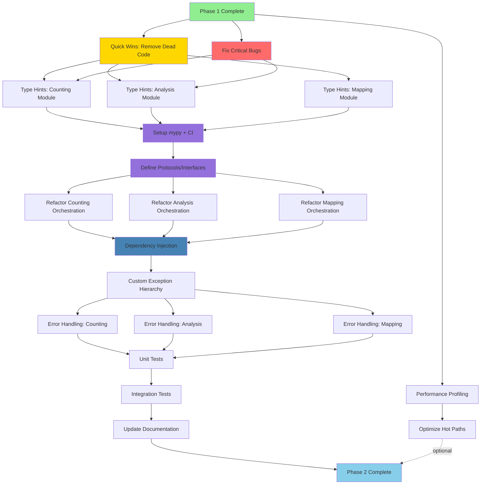

# Phase 2 Task Dependency Graph (DAG)

## Visual DAG



## Task Breakdown with Dependencies

### 🎯 Phase 2A: Foundation (Week 1-2)

| Task ID | Task | Duration | Dependencies | Can Start After |
|---------|------|----------|--------------|-----------------|
| **QW-1** | Remove dead code (300+ LOC) | 2h | None | ✅ Now |
| **QW-2** | Remove debug prints | 30m | None | ✅ Now |
| **QW-3** | Fix None check bugs (C3, A3) | 30m | None | ✅ Now |
| **QW-4** | Use binary search (C1) | 30m | None | ✅ Now |
| **QW-5** | Standardize FDR correction (A5) | 1h | None | ✅ Now |
| **TH-1** | Type hints: counting module | 8h | QW-1, QW-3 | After cleanup |
| **TH-2** | Type hints: analysis module | 8h | QW-1, QW-3 | After cleanup |
| **TH-3** | Type hints: mapping module | 6h | QW-1 | After cleanup |
| **TH-4** | Setup mypy + CI config | 2h | TH-1, TH-2, TH-3 | After all type hints |

**Parallelization:** QW-1 through QW-5 can run in parallel, TH-1/TH-2/TH-3 can run in parallel after QW completes.

---

### 🏗️ Phase 2B: Architecture (Week 3-4)

| Task ID | Task | Duration | Dependencies | Can Start After |
|---------|------|----------|--------------|-----------------|
| **PR-1** | Define AlleleCounter protocol | 2h | TH-4 | After mypy setup |
| **PR-2** | Define VariantFilter protocol | 2h | TH-4 | After mypy setup |
| **PR-3** | Define OutputWriter protocol | 2h | TH-4 | After mypy setup |
| **RC-1** | Refactor counting orchestration | 6h | PR-1, PR-2, PR-3 | After protocols |
| **RA-1** | Refactor analysis orchestration | 6h | PR-1, PR-2, PR-3 | After protocols |
| **RM-1** | Refactor mapping orchestration | 4h | PR-1, PR-2, PR-3 | After protocols |
| **DI-1** | Implement dependency injection | 4h | RC-1, RA-1, RM-1 | After refactors |

**Parallelization:** PR-1/PR-2/PR-3 can run in parallel, RC-1/RA-1/RM-1 can run in parallel after protocols.

---

### 🛡️ Phase 2C: Error Handling (Week 5)

| Task ID | Task | Duration | Dependencies | Can Start After |
|---------|------|----------|--------------|-----------------|
| **EH-1** | Define exception hierarchy | 2h | DI-1 | After DI |
| **EH-2** | Add counting error handling | 3h | EH-1 | After hierarchy |
| **EH-3** | Add analysis error handling | 3h | EH-1 | After hierarchy |
| **EH-4** | Add mapping error handling | 2h | EH-1 | After hierarchy |
| **EH-5** | CLI error handling | 2h | EH-2, EH-3, EH-4 | After all modules |

**Parallelization:** EH-2/EH-3/EH-4 can run in parallel after EH-1.

---

### 🧪 Phase 2D: Testing (Week 6)

| Task ID | Task | Duration | Dependencies | Can Start After |
|---------|------|----------|--------------|-----------------|
| **UT-1** | Unit tests: counting | 6h | EH-2 | After error handling |
| **UT-2** | Unit tests: analysis | 6h | EH-3 | After error handling |
| **UT-3** | Unit tests: mapping | 4h | EH-4 | After error handling |
| **IT-1** | Integration tests | 4h | UT-1, UT-2, UT-3 | After unit tests |
| **DOC-1** | Update all documentation | 4h | IT-1 | After testing |

**Parallelization:** UT-1/UT-2/UT-3 can run in parallel.

---

### ⚡ Phase 2E: Optimization (Parallel Track)

| Task ID | Task | Duration | Dependencies | Can Start After |
|---------|------|----------|--------------|-----------------|
| **PERF-1** | Profile hot paths | 2h | None | ✅ Now (parallel) |
| **OPT-1** | Optimize counting | 4h | PERF-1 | After profiling |
| **OPT-2** | Optimize analysis | 3h | PERF-1 | After profiling |
| **OPT-3** | Memory optimization | 4h | PERF-1 | After profiling |

**Note:** This track runs in parallel with Phase 2A-D.

---

## Critical Path

**Longest dependency chain (32 days @ 4h/day):**
```
START → QW (3h) → TH (8h) → MYPY (2h) → PR (2h) →
RC (6h) → DI (4h) → EH (2h+3h) → UT (6h) → IT (4h) → DOC (4h) → DONE
```

**Total estimated time:** ~44 hours of work over 6 weeks (allowing for testing/iteration).

---

## Parallelization Opportunities

### Week 1: Quick Wins (All Parallel)
```bash
# Start all at once
git checkout -b fix/dead-code && # Remove dead code
git checkout -b fix/none-checks && # Fix None bugs
git checkout -b fix/binary-search && # Use binary search
git checkout -b fix/fdr-standardization && # FDR fixes
```

### Week 2-3: Type Hints (3 Parallel Tracks)
```bash
# After QW merged
git checkout -b feat/types-counting && # Counting types
git checkout -b feat/types-analysis && # Analysis types
git checkout -b feat/types-mapping && # Mapping types
```

### Week 4: Architecture (3 Parallel Tracks)
```bash
# After protocols defined
git checkout -b refactor/counting-arch && # Counting refactor
git checkout -b refactor/analysis-arch && # Analysis refactor
git checkout -b refactor/mapping-arch && # Mapping refactor
```

---

## Progress Tracking

### Current Status
- ✅ Phase 1: Complete (Documentation + Baselines)
- ⏳ Phase 2A: Ready to start (Quick Wins)
- ⬜ Phase 2B: Blocked by 2A
- ⬜ Phase 2C: Blocked by 2B
- ⬜ Phase 2D: Blocked by 2C

### Next Immediate Tasks (Can Start Now)
1. ✅ **QW-1:** Remove dead code (2h) - No blockers
2. ✅ **QW-3:** Fix None check bugs (30m) - No blockers
3. ✅ **QW-4:** Use binary search (30m) - No blockers
4. ✅ **PERF-1:** Profile hot paths (2h) - No blockers (parallel track)

---

## How to Use This DAG

### 1. **Pick Next Task**
Look at "Can Start After" column - choose tasks with ✅ Now or completed dependencies.

### 2. **Run Regression Tests**
```bash
# After ANY change
pytest tests/regression/ -v
```

### 3. **Create Feature Branch**
```bash
git checkout -b <task-id>-description
# Example: git checkout -b QW-1-remove-dead-code
```

### 4. **Mark Complete**
Update this file when tasks complete, update dependencies.

### 5. **Merge to Main**
After each task passes tests, merge to main, update DAG.

---

## Automated Tracking

Add to `.github/workflows/phase2-tracker.yml` (optional):
```yaml
name: Phase 2 Progress Tracker
on: [push, pull_request]

jobs:
  track:
    runs-on: ubuntu-latest
    steps:
      - uses: actions/checkout@v2
      - name: Check completed tasks
        run: |
          # Parse PHASE2_TASK_DAG.md for ✅ vs ⬜
          # Generate progress report
```

---

## Estimated Completion

**Optimistic:** 4 weeks (with parallelization)
**Realistic:** 6 weeks (with testing/iteration)
**Conservative:** 8 weeks (with unforeseen issues)

**Next milestone:** Complete QW-1 through QW-5 by end of Week 1.
