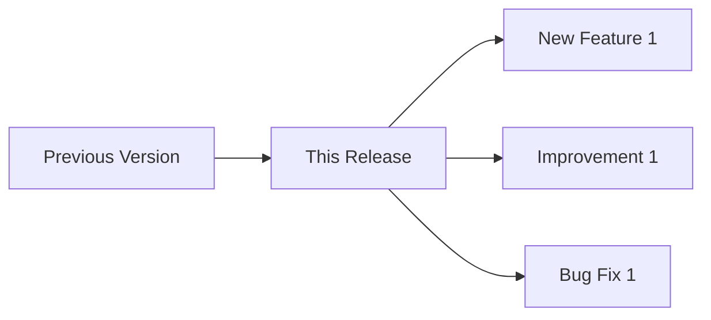

# Buzz Report Template
# Episode: [NUMBER] | Version: [VERSION]
# Date: [DATE]

---

## 🐝 Opening

[happy buzz]

Welcome to the Hive, fellow worker bees!

I'm the Queen Bee, and this is The WASP's Nest - bringing you the latest
buzz from WASP2 development.

Today's Buzz Report covers version [VERSION], and we have some exciting
news from the colony!

---

## 🌸 Foraging: New Features

[excited waggle]

The worker bees have been busy foraging for new capabilities...

### Feature Name

[Description of new feature]

[technical tone]
From a technical perspective, this means [technical details].

---

## 🏗️ Building: Improvements

[precise tone]

The architects of the hive have been building...

### Improvement Name

[Description of improvement]

---

## 🛡️ Defending: Bug Fixes

[satisfied celebration]

Our defenders have squashed some pesky bugs...

### Bug Name

[Description of bug fix]

Buzz buzz! Another one bites the dust.

---

## 🌺 Pollinating: Community

[playful buzz]

Cross-pollination with the broader ecosystem...

### Contribution/Integration

[Description]

---

## 📊 Illumination



---

## 🐝 Closing

[pause]

And that's the buzz for version [VERSION], worker bees!

Remember:
- [Key takeaway 1]
- [Key takeaway 2]

Keep building, keep buzzing!
May your reads map true and your alleles balance.

From the WASP's Nest, this is the Queen Bee.

Buzz out! 🐝

---

## Episode Metadata

```yaml
episode:
  number: [NUMBER]
  version: "[VERSION]"
  date: "[DATE]"
  duration_estimate: "5-7 minutes"
  chapters:
    - name: "Foraging"
      topics: []
    - name: "Building"
      topics: []
    - name: "Defending"
      topics: []
    - name: "Pollinating"
      topics: []
```
