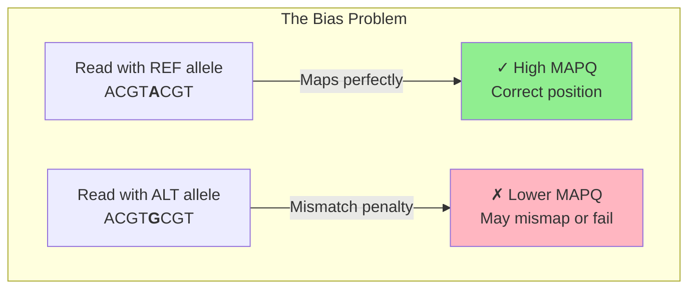
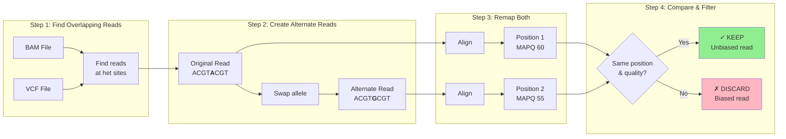
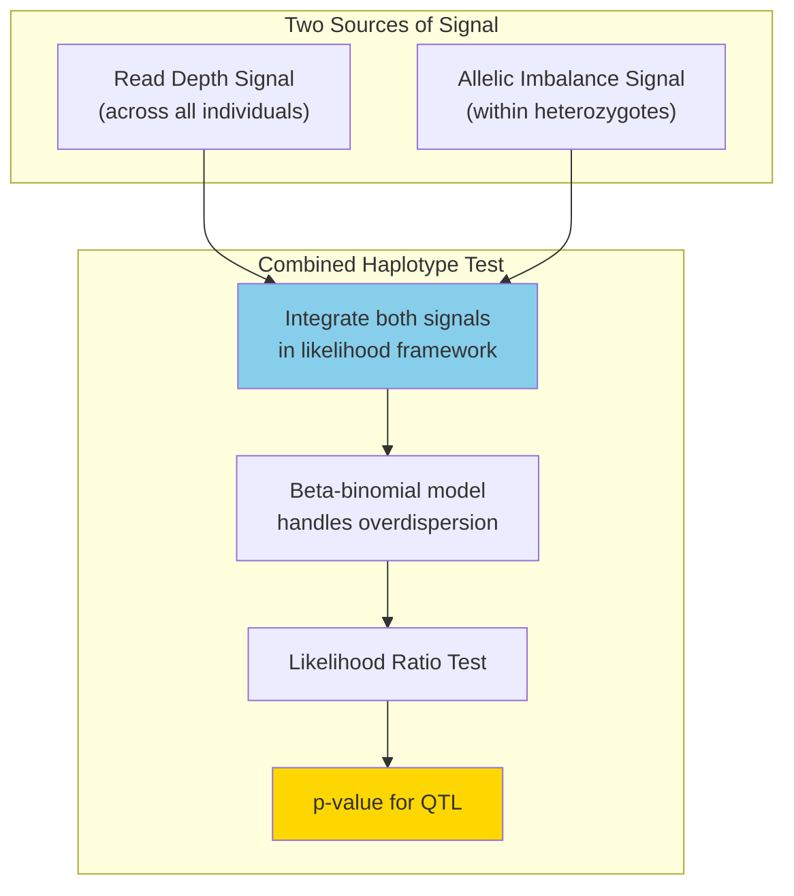
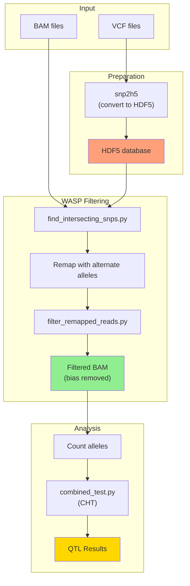
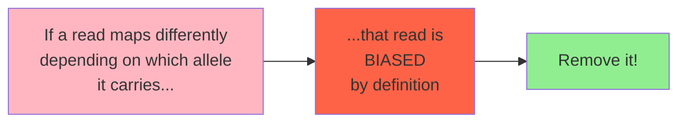

# Illumination: WASP Mapping Bias Correction
# Episode: 001 - The Origin Swarm

## The Problem: Mapping Bias

When reads contain genetic variants, they may map differently depending on which allele they carry.

## The WASP Solution: Allele Swap & Filter

## The Combined Haplotype Test (CHT)

## The Original WASP Pipeline

## Key Insight

---

## Episode Reference
- **Episode**: 001 - The Origin Swarm
- **Topic**: Original WASP mapping bias correction (2015)
- **Paper**: van de Geijn et al., Nature Methods 2015
