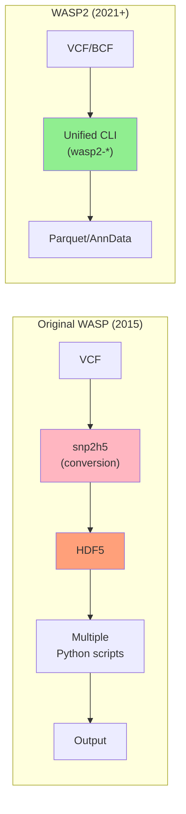
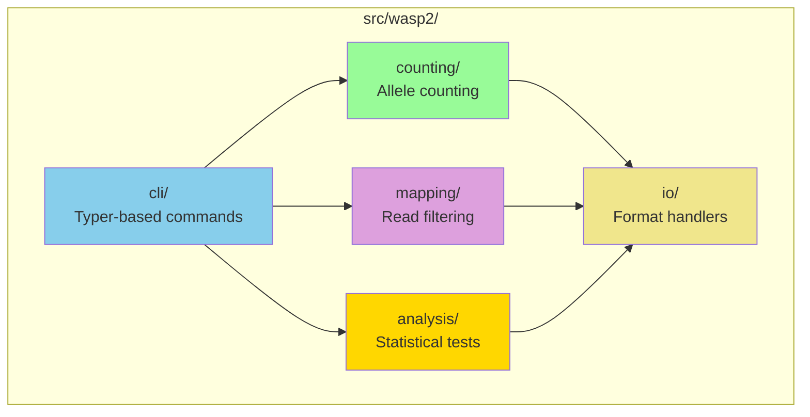
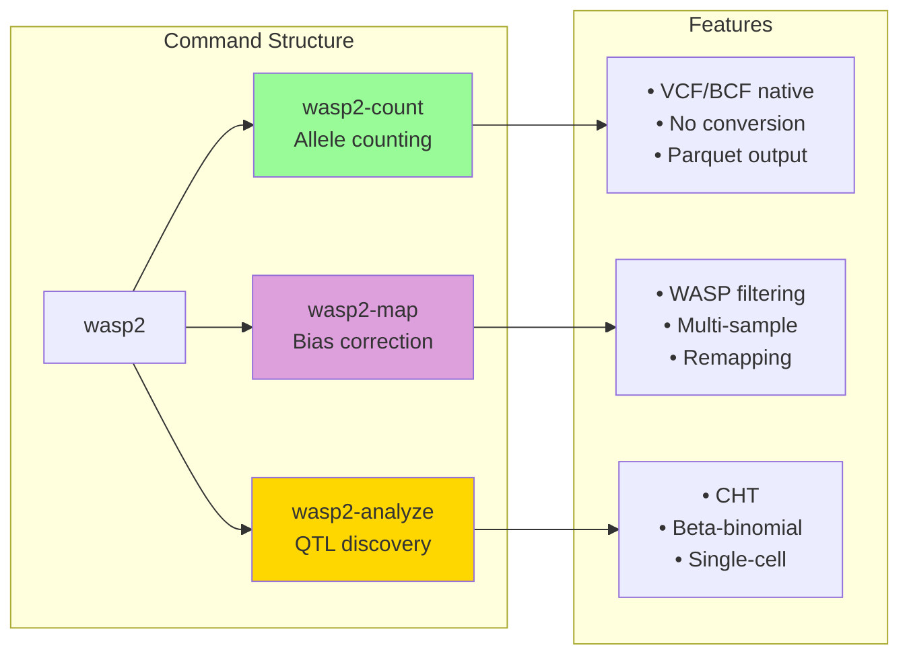
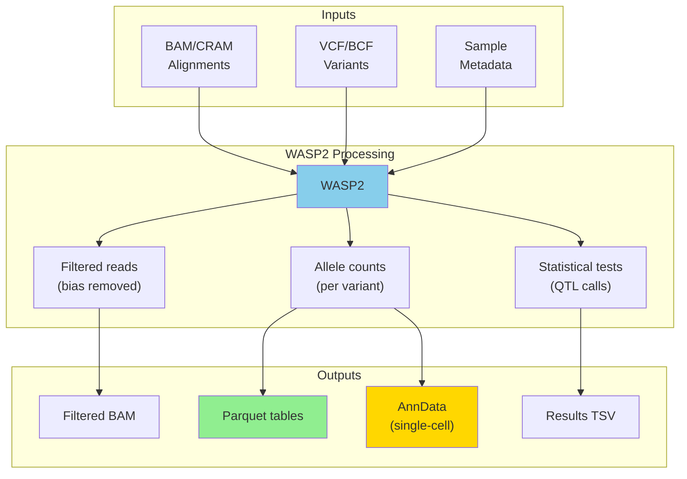
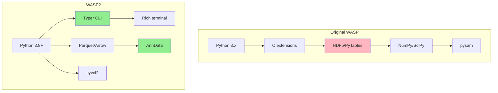
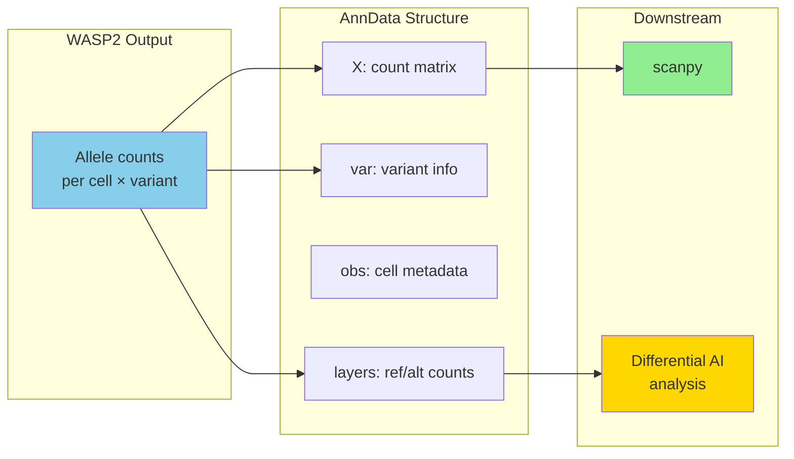
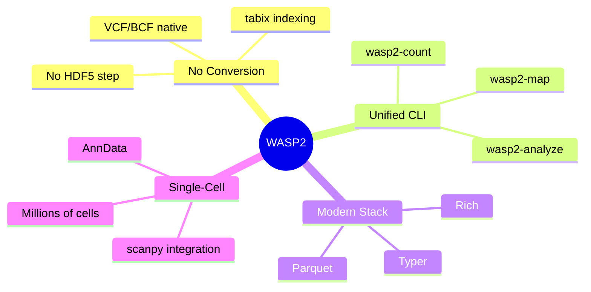

# Illumination: WASP2 Architecture
# Episode: 002 - Building the New Hive

## The Modernization: Old vs New

## Module Organization

## The Unified CLI

## Data Flow

## Technology Stack Comparison

## Single-Cell Integration

## Design Principles

---

## Episode Reference
- **Episode**: 002 - Building the New Hive
- **Topic**: WASP2 modernization and architecture (2021)
- **Repository**: mcvickerlab/WASP2
