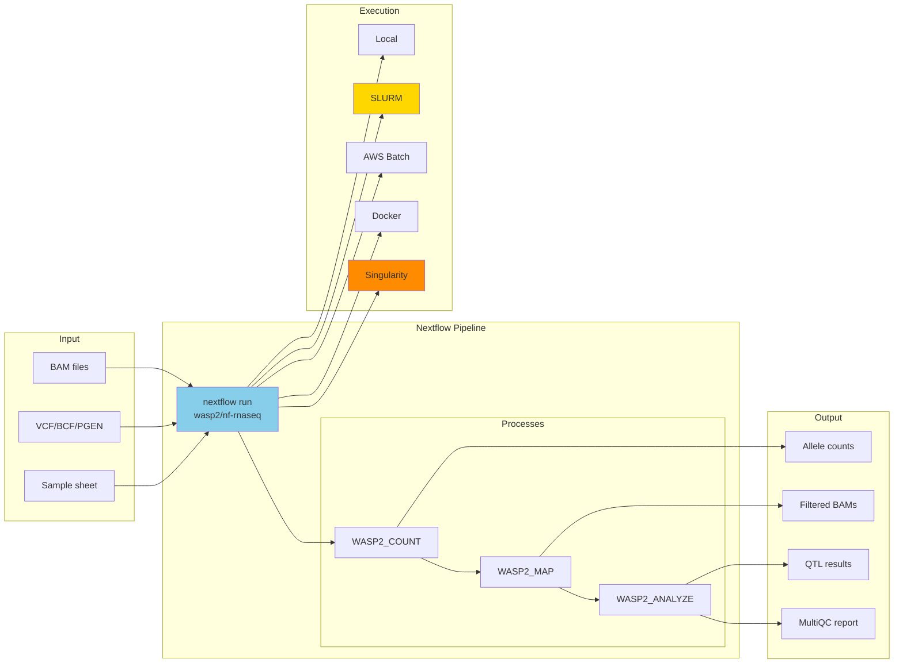

# Illumination: Performance Transformation
# Episode: 003 - The Rust Metamorphosis

## Performance Comparison

## The Speedup Table

## Rust Module Architecture

## The COITree Secret Weapon

## Parallel Processing Architecture

## The Python/Rust Boundary

## New Capabilities Enabled

## Format Speedups

## The 80/20 Principle Applied

*10% of the code was responsible for 95% of the runtime. Rewrite those 10%.*

---

## Deployment Ecosystem

## Nextflow Pipeline Architecture

---

## Episode Reference
- **Episode**: 003 - The Rust Metamorphosis
- **Topic**: Rust acceleration and deployment ecosystem (2024-2026)
- **Version**: 1.3.0
- **Rust Lines**: 10,551+
- **Pipelines**: nf-rnaseq, nf-atacseq, nf-scatac, nf-outrider
